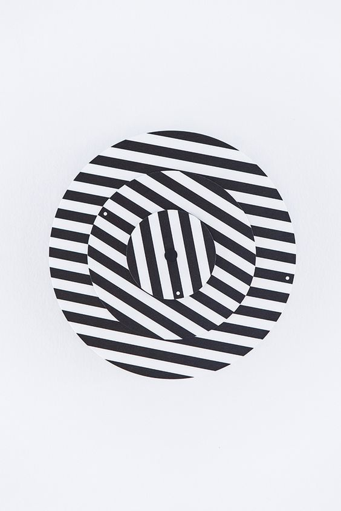
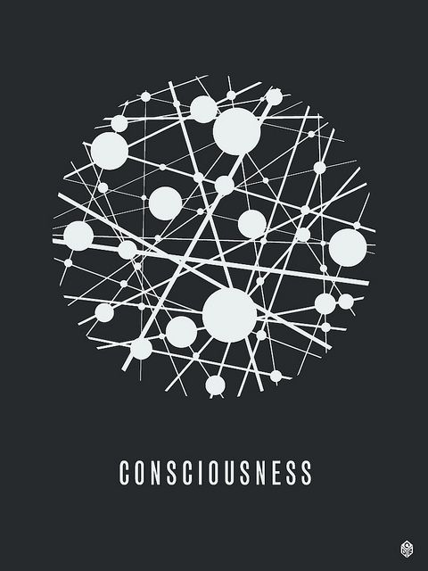

# sliu0991_9103_tut8

# Part 1: Imaging Technique Inspiration

I found the use of repetition of circle art is useful for the assignment as it has a similar element to our group’s chosen artwork ‘Wheels of Fortune’. Compared to the example, they all have three layers in one big circle, and each layer is filled with repetitive circles, arcs and lines. The inspiration images I chose could be one of the patterns filled inside a circle which has vertical black and white stripes whose edges follow the circle's curvature or with interactive lines and circles. It also can be perfectly combined with other techniques with my group members.

# Images

# Part 2: Coding Technique Exploration

First, I can draw the black and white stripes using ‘For loops’ (screenshot 1), I will calculate where the top and bottom edges of the stripe and make it lie within the circle's bounds. Then I can use ‘rotate’ (screenshot 2) to make each layer rotate around the z-axis at different speeds. Then to achieve the second inspiration image, I can use the ‘drawing’ example (screenshot 3&4) which uses ‘class’ to create particles and lines when the user moves their mouse. These coding techniques all assist in implementing the imaging technique in Part 1.

# References

(screenshot 1) (From Week 4 Tutorial page)

(screenshot 2) https://p5js.org/examples/transform-rotate.html

(screenshot 3) https://p5js.org/examples/hello-p5-drawing.html

(screenshot 4) (Note: The code is copy from the p5js website)

